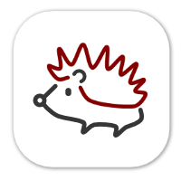
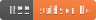

<div align="center">
	
	<h1>🦔 Arxiv Sanity RSS Feeds</h1>
	<p>
		<b>Subscribe to the content published on <a href="http://www.arxiv-sanity.com">Arxiv Sanity</a>.</b>
	</p>
	<br>
	<br>
	<br>
</div>

[](https://github.com/HernandoR/arxiv-sanity-feeds/actions/workflows/spawnfeed.yml)

All this tool does is scrape [Arxiv Sanity](http://www.arxiv-sanity.com), and produce consumable RSS feeds that can be used in your favorite RSS reader (such as Feedly or Outlook).

Feeds are updated daily.

## Feed Locations

### Home Page [](https://pub-5051544be931474a96aa69305ea1e4ad.r2.dev/feeds/home.xml) [](https://github.com/HernandoR/arxiv-sanity-feeds/actions/workflows/validate_home_feed.yml)

```
https://pub-5051544be931474a96aa69305ea1e4ad.r2.dev/feeds/home.xml
```

### Most Recent Papers (Weekly) [](https://pub-5051544be931474a96aa69305ea1e4ad.r2.dev/feeds/toprecent-week.xml) [](https://github.com/HernandoR/arxiv-sanity-feeds/actions/workflows/validate_most_recent_feed.yml)

```
https://pub-5051544be931474a96aa69305ea1e4ad.r2.dev/feeds/toprecent-week.xml
```

### Random Papers (Last Week) [](https://pub-5051544be931474a96aa69305ea1e4ad.r2.dev/feeds/random-last-week.xml) [](https://github.com/HernandoR/arxiv-sanity-feeds/actions/workflows/validate_random_feed.yml)

```
https://pub-5051544be931474a96aa69305ea1e4ad.r2.dev/feeds/random-last-week.xml
```

## Building

1. Install [Python 3](https://www.python.org/) on your target operating system.
2. Create a virtual environment with `python3 -m venv .env`.
3. Install required packages with `pip install -r src/feedingress/requirements.txt`.
4. Set up the following environment variables:
	- `DO_SPACES_ENDPOINT` - this is your DigitalOcean Spaces endpoint, including the `https://` prefix.
	- `DO_SPACES_REGION` - this is your DigitalOcean Spaces region, such as `sfo3`.
	- `DO_SPACES_ACCESS_KEY` - access key for DigitalOcean Spaces. 
	- `DO_SPACES_SECRET_KEY` - secret key for DigitalOcean Spaces.
5. Run the application: `python -m feedingress`.

Once the application runs, it will upload the generated RSS feeds to the Azure Storage account of choice.

## Forking
I failed to use GitHub release as backend storage. let me know if you have any idea.
currently using R2 as backend storage.
 You gonna need to set following `secrets` in your repo: 
 `CLOUDFLARE_R2_ACCESS_ID` and `CLOUDFLARE_R2_ACCESS_KEY,` which are your R2 access id and key. `CLOUDFLARE_R2_BUCKET_NAME` and `CLOUDFLARE_R2_ENDPOINT`, which are your R2 bucket name and endpoint.
 following Vars:
 `R2_DEV_BUCKET_URL` and `R2_PROD_BUCKET_URL`, which is your R2 public url

 also remember to replace the url in the readme file.

